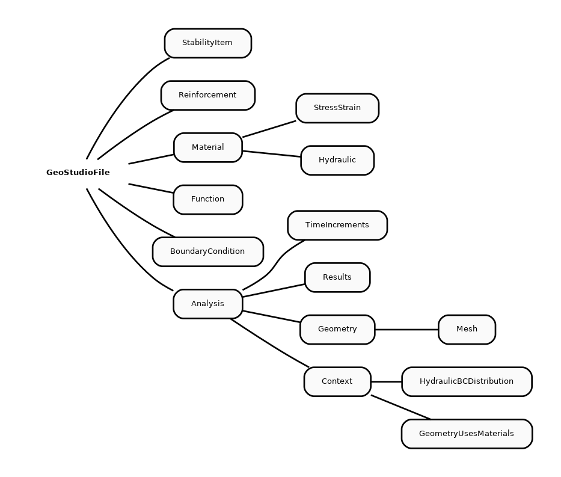

.. _user_guide:

User guide
==========

Accessing a GeoStudio study
---------------------------

Open a study
''''''''''''

PyGeoStudio interfaces the GeoStudio file un Python using the main Python class nammed ``GeoStudioFile`` with the path to the GeoStudio study:

.. code-block:: python

    import PyGeoStudio as pgs
    src_file = "Reinforcement with Anchors.gsz"
    geofile = pgs.GeoStudioFile(src_file,mode='r')

The ``GeoStudioFile`` class then parse the study and create a copy in the computer memory that is accessible with Python (the ``geofile`` object in the code block above).
Therefore, every change made through Python does not affect the input file but rather its representation in the memory.
Modification must be written in a new study in order to be seen by GeoStudio (see "Write back the modified study" section below).

Structure of a study
''''''''''''''''''''

PyGeoStudio tries to reflect the internal representation of the study properties in Python.
The ``GeoStudioFile`` class is the main class which wrap-up the whole study.
It contains numerous attribute, method and subclasses which handle each feature of the study, such as the analyses, material properties, geometries, meshes and so on.
The figure below shows how to access the different feature of a study.

   
   Overview of accessing GeoStudio properties through PyGeoStudio

For example, to assess or change the saturated hydraulic conductivity of a material, the user must first open the study with the ``GeoStudioFile`` class, then assess the given material though the ``Material`` class, get the hydraulic properties interfaced through the ``Hydraulic`` class and get the saturated hydraulic conductivity which is an attribute of the latest class.

Accessing and modifying properties
''''''''''''''''''''''''''''''''''

.. code-block:: python

   geofile.showMaterials()
   toe_drain = geofile.getMaterialByName("Toe drain") #get material nammed "Toe drain"
   toe_drain_ksat = toe_drain["Hydraulic"]["KSat"] #store the material hydraulic conductivity in a Python variable
   toe_drain["Hydraulic"]["KSat"] = 1e-6 #change mat properties

Write back the modified study
'''''''''''''''''''''''''''''

.. code-block:: python

    out_file = "./rapid_drawdown_changed_perm.gsz"
    geofile.writeGeoStudioFile(out_file)

Classes description
-------------------

.. toctree::
   :maxdepth: 1
   
   classes/geostudiofile.rst
   classes/material.rst

